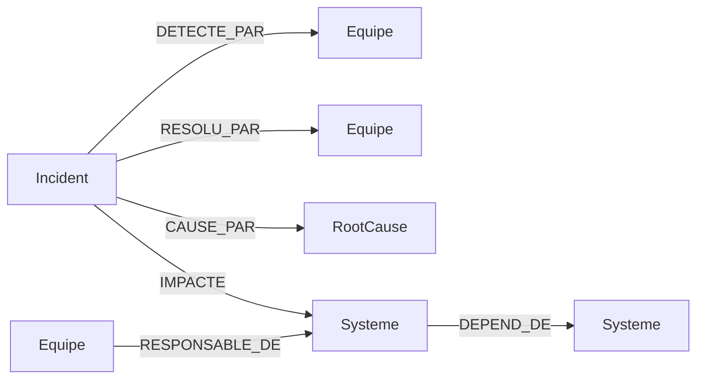

# Ontologie simplifiée — incidents opérationnels bancaires

L'ontologie décrit **comment le texte des incidents devient un graphe**. Elle est
volontairement *simplifiée* : quatre types de nœuds, six types de relations, une
timeline portée par des propriétés.

## Schéma

```
        (:Equipe)                         (:RootCause)
           │  ▲                                ▲
 RESPONSABLE_DE │ DETECTE_PAR / RESOLU_PAR      │ CAUSE_PAR
           │  │                                │
           ▼  │                                │
        (:Systeme) ◀───── IMPACTE ───── (:Incident)
           │  ▲
   DEPEND_DE │ │ DEPEND_DE
           ▼  │
        (:Systeme)
```



## Nœuds

| Label         | Clé          | Propriétés | Origine |
|---------------|--------------|------------|---------|
| `:Incident`   | `id`         | `titre`, `severite`, `date_detection`, `date_resolution`, `mttr_minutes`, `description` | narratif + NER |
| `:Equipe`     | `nom`        | `domaine` | référentiel |
| `:Systeme`    | `nom`        | `type` (contexte opérationnel) | référentiel |
| `:RootCause`  | `libelle`    | `categorie` | référentiel |

## Relations

| Relation                          | Sens | Origine |
|-----------------------------------|------|---------|
| `(:Incident)-[:DETECTE_PAR]->(:Equipe)`   | incident → équipe qui a **détecté** | NER (timeline) |
| `(:Incident)-[:RESOLU_PAR]->(:Equipe)`    | incident → équipe qui a **résolu**  | NER (timeline) |
| `(:Incident)-[:CAUSE_PAR]->(:RootCause)`  | incident → **cause racine**         | NER |
| `(:Incident)-[:IMPACTE]->(:Systeme)`      | incident → **contexte opérationnel** touché | NER |
| `(:Equipe)-[:RESPONSABLE_DE]->(:Systeme)` | propriété du système                | référentiel |
| `(:Systeme)-[:DEPEND_DE]->(:Systeme)`     | dépendance technique                | référentiel |

## Correspondance NER → ontologie

Ce que le NER extrait du texte, et où ça atterrit dans le graphe :

| Cible NER (demande initiale)        | Extraction                          | Élément du graphe |
|-------------------------------------|-------------------------------------|-------------------|
| **Équipes**                         | équipe de détection / de résolution | `:Equipe` + `DETECTE_PAR` / `RESOLU_PAR` |
| **Timeline** (détection, résolution)| horodatages `YYYY-MM-DD HHhMM`      | propriétés `date_detection`, `date_resolution`, `mttr_minutes` |
| **Contexte opérationnel impliqué**  | système entre « … »                 | `:Systeme` + `IMPACTE` |
| **Root cause**                      | libellé de cause racine             | `:RootCause` + `CAUSE_PAR` |

## Choix de modélisation

- **Timeline en propriétés** (et non en nœuds-événements). C'est le choix
  « simplifié ». Une alternative plus riche consisterait à créer des nœuds
  `(:Evenement {type:'detection'|'resolution', horodatage})` reliés à l'incident
  — utile si l'on veut modéliser plus d'étapes (escalade, mitigation, post-mortem).
  Non implémentée ici pour garder l'ontologie lisible.
- **Deux relations d'équipe distinctes** (`DETECTE_PAR` / `RESOLU_PAR`) plutôt
  qu'une seule `IMPLIQUE` : permet les analyses « qui détecte vs qui résout ».
- **`DEPEND_DE`** rend le graphe explorable (analyse d'impact / *blast radius*),
  avec `Core Banking` comme hub central.
